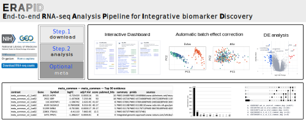

# ERAPID GEO RNA-seq Pipeline

<p align="center">
  
</p>

`erapid.py` orchestrates an end-to-end RNA-seq workflow for public GEO studies (GSE accessions). The CLI guides you through the same sequence of steps used internally by ERAPID: download/public data cleanup, differential expression, enrichment analysis, and optional evidence aggregation. A third *meta* phase can summarise overlapping signals across multiple GSE runs for manuscript-ready tables and plots.

## Install Git and Conda (one-time)

If you do not already have Git or Conda, install them first. These commands work on a fresh Ubuntu/WSL terminal; macOS users can swap the package manager lines for Homebrew.

```bash
# Git
sudo apt update
sudo apt install -y git          # macOS: brew install git
git --version                    # verify

# Miniconda (recommended over full Anaconda)
wget https://repo.anaconda.com/miniconda/Miniconda3-latest-Linux-x86_64.sh
bash Miniconda3-latest-Linux-x86_64.sh
source ~/.bashrc                 # or close/reopen the terminal
conda --version                  # verify
```

On Windows, install WSL2 with Ubuntu, then run the same commands above inside the WSL terminal.

## Quickstart

The steps below work on Linux/WSL/macOS. Windows users should run inside WSL2 or a Unix‑like environment.

1. **Clone the repo and create the Conda environment**  
   ```bash
   git clone https://github.com/kangk1204/ERAPID.git
   cd ERAPID
   conda env create -f environment.yml
   conda activate erapid
   ```

2. **Check that R and the required packages are available**  
   ```bash
   Rscript -e 'pkgs <- c("DESeq2","variancePartition","fgsea","msigdbr"); missing <- pkgs[!sapply(pkgs, requireNamespace, quietly=TRUE)]; if (length(missing)) { cat("Missing packages:", paste(missing, collapse=", "), "\n"); quit(save="no", status=1); } else { cat("All packages available.\\n"); }'
   ```
   If you see “Missing packages…”, install them once via:  
   `Rscript -e 'if (!requireNamespace("BiocManager", quietly=TRUE)) install.packages("BiocManager"); BiocManager::install(c("DESeq2","variancePartition","fgsea","msigdbr"))'`

3. **Run a quick test (download → analysis)**  
   ```bash
   python erapid.py --gse GSE125583           # download phase (downloads data + editable metadata)
   python erapid.py --gse GSE125583 --phase analysis --group_col group_primary --group_ref Control
   ```
   This creates `GSE125583/` with DEG, FGSEA, and dashboard outputs under `02_DEG/` and `03_GSEA/`.

4. **Open the dashboard**  
   ```bash
   xdg-open GSE125583/index.html       # Linux/WSL
   open GSE125583/index.html           # macOS
   ```

5. **(Optional) Meta-analysis across prior runs**  
   ```bash
   python erapid.py --phase meta \
     --gse GSE104704,GSE125583,GSE153873 \
     --group_col group_primary \
     --out meta_results
   ```
   `--gse` accepts a comma-separated list for meta runs. For download/analysis, run one GSE at a time (repeat the commands per accession).
   Open `meta_results/index.html` to explore overlap, evidence summaries, and downloads.

**Dependencies recap**
- Conda (Python 3.9+) with packages defined in `environment.yml`
- R ≥ 4.3 with the Bioconductor/Tidyverse libraries above
- `curl` (or HTTPS-enabled Python) for GEO downloads

*Legacy note*: older commands using `--phase prepare` or `--phase analyze` still work; they map to `--phase download` and `--phase analysis` respectively.

## Standard Workflow

1. **Download phase – fetch counts and curate sample groups**

   ```bash
   python erapid.py --gse GSE125583
   ```

   - Creates `GSE125583/` with `01_GEO_data/`, an editable `GSE125583_coldata_for_edit.tsv`, and heuristic grouping suggestions under `GSE125583__group_selection_suggestions.txt`.
   - Review the TSV and populate `group_primary` (plus optional covariates) before continuing.

2. **Analysis phase – run DESeq2/dream and FGSEA**

   ```bash
   python erapid.py \
     --gse GSE125583 \
     --phase analysis \
     --group_col group_primary \
     --group_ref Control \
     --deg_method both \
     --evidence_keywords alzheimer,amyloid
   ```

   - Reads the curated coldata, executes DESeq2 and/or dream (`--deg_method`), and launches FGSEA on ranked features.
   - Optional flags:
     - `--auto_batch_cols` to auto-include common covariates (sex/age/tissue) in the design.
   - `--batch_cols age,sex` for an explicit formula.
   - `--deg_padj_thresh 0.1` to relax/tighten the adjusted p-value threshold used across DESeq2, dream, and meta summaries (default 0.05).
   - `--deseq2_min_count 5` to change the raw-count prefilter applied before DESeq2 fitting (dream retains its own `--dream_min_count` setting).
   - `--group_ref Control,Treated` sets the *reference (denominator) order* for every contrast. See [Group Reference](#group-reference) for detailed behavior and examples.
 - `--skip_fgsea` or `--skip_deg` to shorten the workflow when debugging.
 - Batch/SVA safety defaults (designed to avoid over-correction):
   - `--sva_auto_skip_n 6` (default): n ≤ 6 → skip SVA entirely and use design-only.
   - `--sva_corr_p_thresh 0.05` and `--sva_guard_cor_thresh 0.8`: SVs are dropped if they associate with group/known covariates/libsize/zero-fraction/QC at p < 0.05 or |cor| ≥ 0.8.
   - dream auto-imports DESeq2 AUTO SVs when available; disable with `--no_auto_sv_from_deseq2`. The same guards apply.
  
  **Interpretation of the SVA guard (AUTO mode).** `p < sva_corr_p_thresh` is a *drop* rule, not an inclusion trigger: if an SV shows evidence of tracking the biology/QC at p < 0.05 (or |cor| ≥ guard), AUTO excludes it and falls back to design-only for a more conservative fit. Larger cohorts make small p-values easier, so the same threshold can guard more often; ERAPID pairs this with a deterministic sample-size cap (`--sva_cap_auto`, sqrt rule) and per-run sensitivity reports (`__sensitivity.html`) that show sample-size–matched FDR/TPR/Jaccard. Borderline cases are handled conservatively (drop SVs to avoid over-correction), and every decision is recorded for reproducibility (`__auto_summary.html`, `run_metadata.json`, `--seed`).
  - Per-GSE SVA diagnostics: each run writes an AUTO summary (`02_DEG/*__auto_summary.html`) with an interactive guard map and a sensitivity snapshot (`02_DEG/*__sensitivity.html`) showing sample-size–matched FDR/TPR/Jaccard. Use these to demonstrate AUTO avoided over-correction; there is no shared Supplementary card across GSEs.

3. **Inspect results**
   - Differential expression tables (`02_DEG/`), FGSEA outputs (`03_GSEA/`), and HTML dashboards are written inside the GSE directory.
   - `run_metadata.json` captures runtime provenance for reproducibility.
   - Open `GSE125583/index.html` (or the corresponding `index.html` for your study) to explore volcano/MA plots, QC summaries, and evidence tables.

<a id="group-reference"></a>
### Group Reference — `--group_ref`

`--group_ref` accepts a comma-separated priority list that determines which level(s) are treated as the reference (control) when ERAPID assembles contrasts. Every log₂ fold change, RNK score, FGSEA enrichment plot, and meta-summary is interpreted as **test vs. reference**, so setting this flag correctly is critical for downstream conclusions.

How it works:
- The pipeline scans the list from left to right. For each entry that exists in the `group_col`, ERAPID relevels the factor so that entry becomes the denominator.
- Two-level design (`Control` vs. `Treated`): `--group_ref Control` or `--group_ref Control,Treated` ensures positive log₂ fold changes indicate genes higher in `Treated` relative to `Control`.
- Multi-level design (e.g., `Control`, `MD`, `AD`): `--group_ref Control,MD` first generates contrasts `MD vs Control` and `AD vs Control`. Because `MD` was listed second, ERAPID then produces `AD vs MD`, keeping `MD` as reference for that specific comparison.
- If a listed level is absent in the data, ERAPID skips it and falls back to the first matching level (or auto-detects typical control labels). If nothing matches, it defaults to the first factor level in `group_col`.

Practical tips:
- Double-check the exact spelling/case in your curated coldata (`Control` ≠ `control`).
- Include all expected control-like groups in descending priority: e.g. `--group_ref Control,Vehicle,Baseline`.
- Meta analysis reads whatever orientation you established during the analysis phase; it does not re-level groups. Re-run the analysis phase with the desired `--group_ref` before aggregating if you need to change directionality.

If results appear “flipped” (e.g., known control genes show positive log₂ fold change), revisit your `--group_ref` setting first.

## Meta-analysis Examples

Aggregate previously analyzed studies to highlight shared signatures:

```bash
python erapid.py \
  --phase meta \
  --gse GSE104704,GSE125583,GSE153873,GSE190185,GSE95587 \
  --group_col group_primary \
  --method both \
  --out meta_results
   ```

- `--method` accepts `both`, `deseq2`, or `dream` depending on which DEG tables are present.
- `--base_dir` can list multiple search roots (comma-separated) if GSE folders live outside the repo.
- Filter specific contrasts in meta with `--meta_include`: pass comma-separated `GSEID:contrast_label` pairs. Example to drop `ad_vs_young_common_deg` but keep `ad_vs_old_common_deg` for GSE153873:  
  `--meta_include GSE153873:ad_vs_old_common_deg,GSE95587:ad_vs_control_common_deg`  
  Only listed contrasts are used for those GSEs; any GSE not mentioned keeps all contrasts.
- Outputs include summary TSVs, an UpSet overlap plot (when `upsetplot` and `matplotlib` are available), and evidence-ready manifests under `meta_results/`.
- Launch `meta_results/index.html` to review the aggregated dashboard, interactive evidence tables, and quick links to per-contrast outputs.

Additional variations:

1. **Dream-only meta combining different folders**
   ```bash
   python erapid.py \
     --phase meta \
     --gse GSE190185,GSE95587 \
     --method dream \
     --base_dir /data/erapid_runs,/backup/erapid_runs \
     --group_col group_primary \
     --out meta_results/dream_only
   ```

2. **Restrict meta to prefiltered contrasts**
   ```bash
   python erapid.py \
     --phase meta \
     --gse GSE125583 \
     --group_col group_primary \
     --method deseq2 \
     --deg_lfc_thresh 0.7 \
     --out meta_results/GSE125583_deseq2_LFC0p7
   ```

### Meta Evidence Search

Augment shared gene sets with external evidence by providing keywords when running the meta phase:

```bash
python erapid.py \
  --phase meta \
  --gse GSE104704,GSE125583 \
  --group_col group_primary \
  --method both \
  --evidence_keywords alzheimer,amyloid,neurodegeneration \
  --evidence_top_n 40 \
  --out meta_results
```

- `--evidence_keywords` is a comma-separated list handed to `03_deg_evidence.py` to query PubMed/clinical sources for the top-ranked genes. If omitted, ERAPID will reuse keywords discovered during the analysis phase whenever possible.
- `--evidence_top_n` controls how many genes feed into the search (default 30).
- Add `--force_evidence` to generate per-method evidence tables (separate DESeq2 and dream reports) alongside the combined summary.

## Helpful Flags

- `--seed`: set an R random seed for reproducibility.
- `--no_interactive_plots`: skip HTML volcano/MA plots when running headless.
- `--force_evidence` / `--evidence_top_n`: control the evidence-gathering stage for prioritized genes.
- `--group_ref`: sets contrast orientation; see [Group Reference](#group-reference) for details.
- `--deg_padj_thresh`: unified padj cut-off used by DESeq2, dream, and meta dashboards.
- `--deseq2_min_count` / `--dream_min_count`: raw count thresholds for each DEG engine’s prefilter step.

## SVA Sensitivity (Supplementary)

- Shared simulations (one-time, optional): `Rscript supplementary/sva_sensitivity/sva_sensitivity.R` regenerates the FDR/TPR, Jaccard, borderline-case figures, and summary TSVs. Handy if you want fresh copies of the reference plots; not required for routine runs.
- Per-run QC outputs (each in `GSE.../02_DEG/`):
  - `*__auto_summary.html`: interactive guard map plus a plain-English note on why AUTO kept or dropped SVs.
  - `*__sensitivity.html`: sample-size–matched FDR/TPR/Jaccard and design vs. SVA overlap.
  - `*__auto_guard.png`: static guard plot if you prefer an image.
- Safe defaults (already baked in): `--sva_auto_skip_n 6`, `--sva_corr_p_thresh 0.05`, `--sva_cap_auto` (sqrt rule, cap 5 for n≥30). For n<20, keep p<0.05 and cap SVs around 2; if AUTO rejects SVs, stick with design-only.

For a complete list of arguments, run:

```bash
python erapid.py --help
```

## Reproduce Manuscript Batch Run

To rerun the same GEO analyses used in the paper, start from the repo root with the ERAPID Conda env active, then execute:

```bash
conda activate erapid
bash batch_analysis.sh
```

You should see progress logs similar to:

```
[info] Checking NCBI-generated files for GSE95587 ...
[info] Downloading raw_counts: https://www.ncbi.nlm.nih.gov/geo/download/?type=rnaseq_counts&acc=GSE95587&format=file&file=GSE95587_raw_counts_GRCh38.p13_NCBI.tsv.gz
[info] Wrote: /home/kangk/projects/00_ERAPID_revision/ERAPID/GSE95587/01_GEO_data/GSE95587_raw_counts_GRCh38.p13_NCBI.tsv.gz
[info] Downloading fpkm: https://www.ncbi.nlm.nih.gov/geo/download/?type=rnaseq_counts&acc=GSE95587&format=file&file=GSE95587_norm_counts_FPKM_GRCh38.p13_NCBI.tsv.gz
[info] Wrote: /home/kangk/projects/00_ERAPID_revision/ERAPID/GSE95587/01_GEO_data/GSE95587_norm_counts_FPKM_GRCh38.p13_NCBI.tsv.gz
[info] Downloading tpm: https://www.ncbi.nlm.nih.gov/geo/download/?type=rnaseq_counts&acc=GSE95587&format=file&file=GSE95587_norm_counts_TPM_GRCh38.p13_NCBI.tsv.gz
```

The script walks through each manuscript GSE accession, downloading counts, running DEG/FGSEA, and writing dashboards under the corresponding `GSE.../` folders.

## Citation
Park, J., Youn, S., Kang, K., & Kang, K. ERAPID: an end‑to‑end RNA‑seq analysis pipeline for integrative candidate biomarker discovery with applications to neuropsychiatric disorders. Methods (San Diego, Calif.), S1046-2023.
